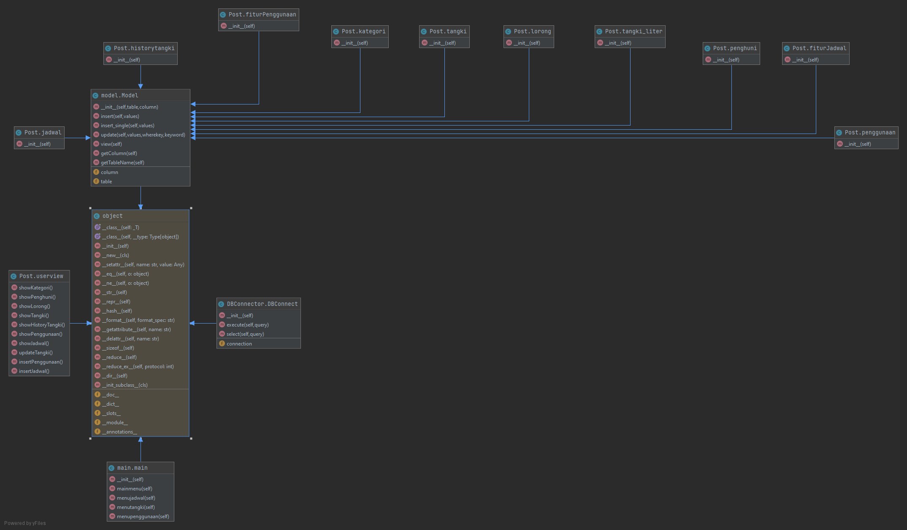
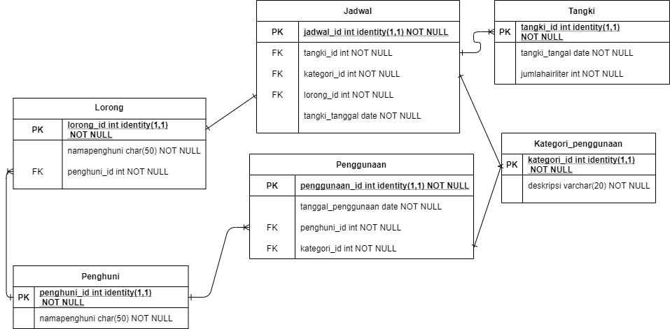

# Sistem-Penjadwalan-Air
penerapan PBO untuk masalah fasilitas air di salah satu PPM di Jember, mengkoneksikan dengan database sederhana
Run the code in here >> https://replit.com/@ZinedineR/Sistem-Penjadwalan-Air-2#main.py

Class Diagram :

ERD Database :

