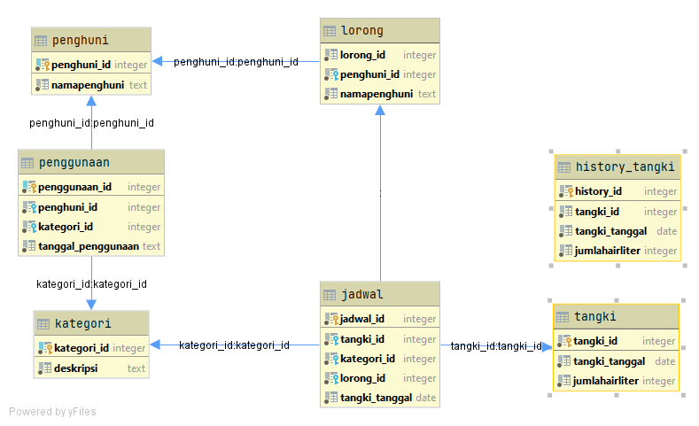

# Sistem-Penjadwalan-Air
penerapan PBO untuk masalah fasilitas air di salah satu PPM di Jember, mengkoneksikan dengan database sederhana
Run the code in here >> https://repl.it/@ZinedineR/Sistem-Penjadwalan-Air#main.py

Class Diagram :

ERD Database :

